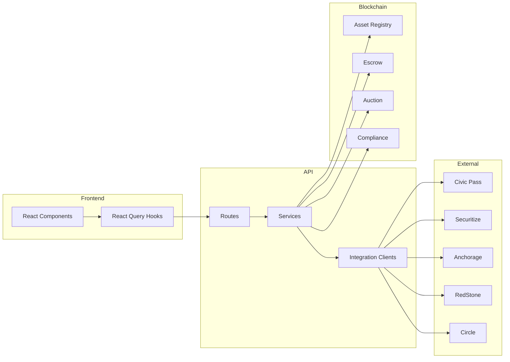
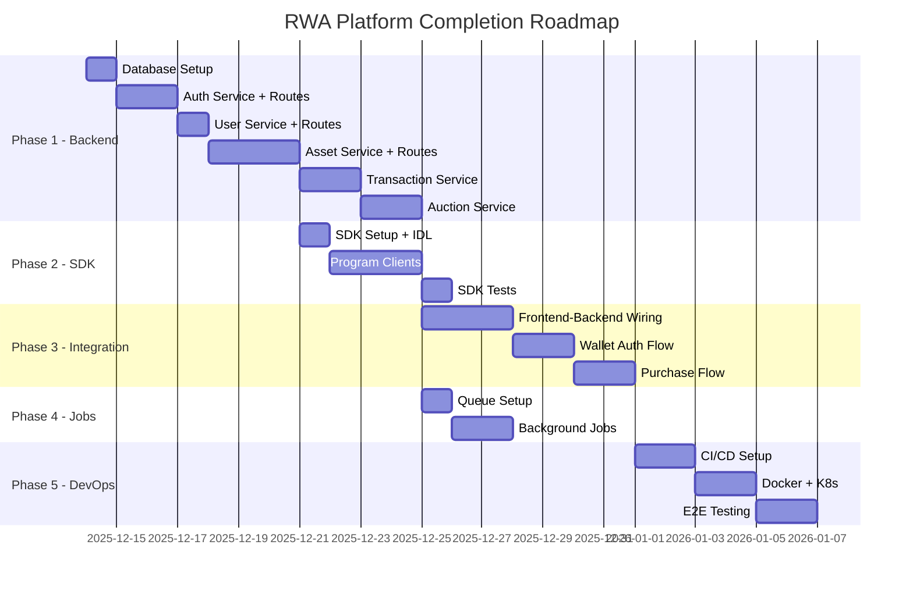

# 🏗️ RWA Asset Tokenization Platform - Completion Plan

> **Generated:** December 13, 2025  
> **Current Progress:** ~70% Complete  
> **Target:** Production-Ready Application

---

## 📊 Executive Summary

The RWA Asset Tokenization Platform is a sophisticated Solana-based application for tokenizing real-world bank assets. After analyzing the codebase, here's what's **completed** vs what's **remaining**:

### ✅ What's Built (Completed)
| Component | Status | Notes |
|-----------|--------|-------|
| Smart Contracts | ✅ 100% | All 4 Anchor programs complete with tests |
| Frontend UI | ✅ 100% | Full investor + bank portal with all pages |
| Integration Clients | ✅ 100% | Civic, Securitize, Anchorage, RedStone, Circle, Jupiter |
| Database Schema | ✅ 100% | Complete Prisma schema |
| API Route Stubs | ✅ 100% | All endpoints defined |
| Documentation | ✅ 100% | Architecture, integration guides |

### 🔴 What's Missing (Remaining Work)
| Component | Status | Priority |
|-----------|--------|----------|
| Backend Business Logic | ❌ 0% | **Critical** |
| TypeScript SDK | ❌ 0% | High |
| Authentication/Authorization | ❌ 0% | **Critical** |
| Database Migrations | ❌ 0% | **Critical** |
| Frontend-Backend Integration | ❌ 0% | **Critical** |
| DevOps/CI-CD | ❌ 0% | Medium |
| E2E Testing | ❌ 0% | Medium |

---

## 🔴 Critical Gap: The API Routes Are Empty Stubs

The most significant gap is that **all API routes are placeholder stubs** with TODO comments. For example:

```typescript
// Current state of apps/api/src/routes/auth.ts
authRouter.post('/login', async (req, res, next) => {
  try {
    // TODO: Implement login logic
    res.json({ success: true, message: 'Login endpoint - implement me' });
  } catch (error) {
    next(error);
  }
});
```

This means the frontend UI is complete but **cannot function** because there's no backend logic.

---

## 📋 Remaining Work Breakdown

### 1️⃣ Backend Services Layer (Critical - Must Do First)

Create the service layer that contains all business logic:

```
apps/api/src/services/
├── AuthService.ts          # JWT auth, wallet signature verification
├── UserService.ts          # User CRUD, profile management
├── AssetService.ts         # Asset CRUD, tokenization workflow
├── TransactionService.ts   # Buy/sell, escrow management
├── AuctionService.ts       # Auction lifecycle management
├── ComplianceService.ts    # KYC/AML checks
├── DocumentService.ts      # S3 upload/download
├── NotificationService.ts  # Email/push notifications
└── PriceService.ts         # Oracle price feeds
```

**Key Files to Create:**

#### AuthService.ts
- JWT token generation/validation
- Wallet signature verification (sign message with wallet)
- Refresh token rotation
- Session management with Redis

#### AssetService.ts
- Create/update/delete assets
- Tokenization workflow orchestration
- Integration with Securitize TokenizationService
- Document management
- Status transitions

#### TransactionService.ts
- Purchase flow orchestration
- Escrow creation on-chain
- Token transfer execution
- Transaction history

---

### 2️⃣ Complete API Route Implementations

Each route needs full implementation with:
- Request validation (Zod schemas)
- Authentication middleware
- Role-based authorization
- Service layer calls
- Proper error handling

**Files to Update:**

| File | Endpoints to Implement |
|------|----------------------|
| `routes/auth.ts` | login, logout, refresh, wallet-connect, nonce |
| `routes/users.ts` | me, update profile, kyc-status, initiate-kyc |
| `routes/assets.ts` | CRUD, tokenize, documents upload/download |
| `routes/transactions.ts` | create, list, get details |
| `routes/auctions.ts` | create, bid, settle, cancel |

---

### 3️⃣ Middleware Layer

```
apps/api/src/middleware/
├── auth.ts              # JWT verification
├── rbac.ts              # Role-based access control
├── validation.ts        # Zod request validation
├── rateLimiter.ts       # Per-endpoint rate limiting
└── audit.ts             # Audit logging middleware
```

---

### 4️⃣ TypeScript SDK Package

Create a client SDK for frontend and external integrations:

```
packages/sdk/
├── package.json
├── tsconfig.json
├── src/
│   ├── index.ts
│   ├── client.ts              # Main RWA client
│   ├── programs/
│   │   ├── assetRegistry.ts   # Asset registry program client
│   │   ├── escrow.ts          # Escrow program client
│   │   ├── auction.ts         # Auction program client
│   │   └── compliance.ts      # Compliance hook client
│   ├── types/
│   │   ├── index.ts
│   │   ├── asset.ts
│   │   ├── escrow.ts
│   │   └── auction.ts
│   ├── utils/
│   │   ├── pda.ts             # PDA derivation helpers
│   │   ├── transaction.ts     # Transaction helpers
│   │   └── constants.ts       # Program IDs
│   └── idl/
│       ├── asset_registry.json
│       ├── escrow.json
│       ├── auction.json
│       └── compliance.json
└── tests/
    ├── assetRegistry.test.ts
    ├── escrow.test.ts
    └── auction.test.ts
```

---

### 5️⃣ Database Setup

```
apps/api/prisma/
├── migrations/          # Generate with: npx prisma migrate dev
└── seed.ts              # Seed data for development
```

**Tasks:**
1. Run `npx prisma generate` to generate Prisma client
2. Run `npx prisma migrate dev` to create migrations
3. Create seed script with sample data
4. Add migration to CI/CD pipeline

---

### 6️⃣ Background Jobs

```
apps/api/src/jobs/
├── queue.ts              # BullMQ queue setup
├── tokenization.job.ts   # Process tokenization requests
├── notification.job.ts   # Send emails/push notifications
├── priceUpdate.job.ts    # Fetch oracle prices periodically
├── kycSync.job.ts        # Sync KYC status from Civic
└── auctionSettlement.job.ts # Auto-settle completed auctions
```

---

### 7️⃣ DevOps & Infrastructure

```
.github/workflows/
├── ci.yml                # Lint, test, build on PR
├── deploy-staging.yml    # Deploy to staging
├── deploy-production.yml # Deploy to production
└── contracts.yml         # Build/test Anchor programs

apps/api/Dockerfile
apps/web/Dockerfile
docker-compose.prod.yml
infrastructure/
├── terraform/            # AWS/GCP infrastructure
└── kubernetes/           # K8s manifests
```

---

## 🔄 Integration Points That Need Wiring

The integration clients are built but need to be wired into the services:



**Current State:** A → B → C → ❌ (stops at route stubs)  
**Target State:** A → B → C → D → E → External/Blockchain

---

## 📝 Detailed Task List

### Phase 1: Core Backend (Critical Path)

| # | Task | Files | Priority |
|---|------|-------|----------|
| 1.1 | Set up Prisma client and migrations | `prisma/` | P0 |
| 1.2 | Create AuthService with JWT + wallet auth | `services/AuthService.ts` | P0 |
| 1.3 | Create auth middleware | `middleware/auth.ts` | P0 |
| 1.4 | Implement auth routes | `routes/auth.ts` | P0 |
| 1.5 | Create UserService | `services/UserService.ts` | P0 |
| 1.6 | Implement user routes | `routes/users.ts` | P0 |
| 1.7 | Create AssetService | `services/AssetService.ts` | P0 |
| 1.8 | Implement asset routes | `routes/assets.ts` | P0 |
| 1.9 | Create TransactionService | `services/TransactionService.ts` | P1 |
| 1.10 | Implement transaction routes | `routes/transactions.ts` | P1 |
| 1.11 | Create AuctionService | `services/AuctionService.ts` | P1 |
| 1.12 | Implement auction routes | `routes/auctions.ts` | P1 |

### Phase 2: SDK Development

| # | Task | Files | Priority |
|---|------|-------|----------|
| 2.1 | Set up SDK package structure | `packages/sdk/` | P1 |
| 2.2 | Generate IDL types from Anchor | `packages/sdk/src/idl/` | P1 |
| 2.3 | Create Asset Registry client | `programs/assetRegistry.ts` | P1 |
| 2.4 | Create Escrow client | `programs/escrow.ts` | P1 |
| 2.5 | Create Auction client | `programs/auction.ts` | P1 |
| 2.6 | Create PDA utilities | `utils/pda.ts` | P1 |
| 2.7 | Write SDK tests | `tests/` | P1 |
| 2.8 | Publish to npm | - | P2 |

### Phase 3: Frontend-Backend Integration

| # | Task | Files | Priority |
|---|------|-------|----------|
| 3.1 | Update API client to match backend | `apps/web/lib/api.ts` | P0 |
| 3.2 | Add proper error handling in hooks | `apps/web/hooks/` | P1 |
| 3.3 | Implement wallet signature auth flow | `components/wallet/` | P0 |
| 3.4 | Wire up KYC flow with Civic | `app/(investor)/kyc/` | P1 |
| 3.5 | Implement purchase flow | `app/(investor)/asset/` | P1 |
| 3.6 | Add real-time updates via WebSocket | `providers/` | P2 |

### Phase 4: Background Jobs & Queues

| # | Task | Files | Priority |
|---|------|-------|----------|
| 4.1 | Set up BullMQ with Redis | `jobs/queue.ts` | P1 |
| 4.2 | Create tokenization job | `jobs/tokenization.job.ts` | P1 |
| 4.3 | Create price update job | `jobs/priceUpdate.job.ts` | P2 |
| 4.4 | Create notification job | `jobs/notification.job.ts` | P2 |
| 4.5 | Create auction settlement job | `jobs/auctionSettlement.job.ts` | P2 |

### Phase 5: DevOps & Testing

| # | Task | Files | Priority |
|---|------|-------|----------|
| 5.1 | Create CI workflow | `.github/workflows/ci.yml` | P1 |
| 5.2 | Create API Dockerfile | `apps/api/Dockerfile` | P2 |
| 5.3 | Create Web Dockerfile | `apps/web/Dockerfile` | P2 |
| 5.4 | Write API integration tests | `apps/api/tests/` | P2 |
| 5.5 | Write E2E tests | `apps/web/e2e/` | P2 |
| 5.6 | Set up staging deployment | `.github/workflows/deploy-staging.yml` | P2 |

---

## 🎯 Recommended Execution Order



---

## 💡 Key Implementation Notes

### 1. Authentication Flow

The wallet-based auth should work like:

```typescript
// 1. Frontend requests nonce
const { nonce } = await api.auth.getNonce(walletAddress);

// 2. User signs nonce with wallet
const signature = await wallet.signMessage(nonce);

// 3. Backend verifies signature and issues JWT
const { token, user } = await api.auth.login(walletAddress, signature);

// 4. Store token, include in all requests
localStorage.setItem('authToken', token);
```

### 2. Asset Tokenization Flow

```
1. Bank creates asset draft → AssetService.create()
2. Bank uploads documents → DocumentService.upload()
3. Bank submits for review → AssetService.submitForReview()
4. Admin approves → AssetService.approve()
5. System tokenizes via Securitize → TokenizationService.createOffering()
6. Deploy token on-chain → SDK.assetRegistry.registerAsset()
7. List on marketplace → AssetService.list()
```

### 3. Purchase Flow

```
1. Investor browses marketplace → AssetService.listAvailable()
2. Investor initiates purchase → TransactionService.createOrder()
3. System creates escrow on-chain → SDK.escrow.createEscrow()
4. Investor deposits USDC → SDK.escrow.deposit()
5. Compliance check passes → ComplianceHook validates
6. Tokens transferred → SDK.assetRegistry.transferTokens()
7. Escrow released → SDK.escrow.release()
```

---

## ⚠️ Dependencies & Prerequisites

Before starting development:

1. **Environment Variables** - Ensure all API keys are obtained:
   - Civic Pass API key
   - Securitize API key + Issuer ID
   - Anchorage API key + Vault ID
   - RedStone API key
   - Circle API key (optional)

2. **Infrastructure**
   - PostgreSQL database running
   - Redis instance for sessions/queues
   - S3 bucket for documents (or local MinIO)
   - Solana RPC endpoint (Helius/QuickNode recommended)

3. **Solana Wallet**
   - Platform authority keypair for signing transactions
   - Funded with SOL for transaction fees

---

## 📊 Effort Estimation Summary

| Phase | Scope | Complexity |
|-------|-------|------------|
| Phase 1: Backend Services | 12 services + routes | High |
| Phase 2: TypeScript SDK | 1 package with 4 program clients | Medium |
| Phase 3: Frontend Integration | Wiring 12+ pages | Medium |
| Phase 4: Background Jobs | 5 job processors | Low |
| Phase 5: DevOps | CI/CD + Docker + K8s | Medium |

---

## 🚀 Next Steps

1. **Immediate:** Set up database and run migrations
2. **Day 1-3:** Implement AuthService and auth routes
3. **Day 4-7:** Implement AssetService and core routes
4. **Week 2:** Complete SDK and frontend integration
5. **Week 3:** Background jobs and DevOps
6. **Week 4:** Testing and deployment

---

*This plan was generated based on analysis of the current codebase. The actual implementation may require adjustments based on specific requirements and constraints.*