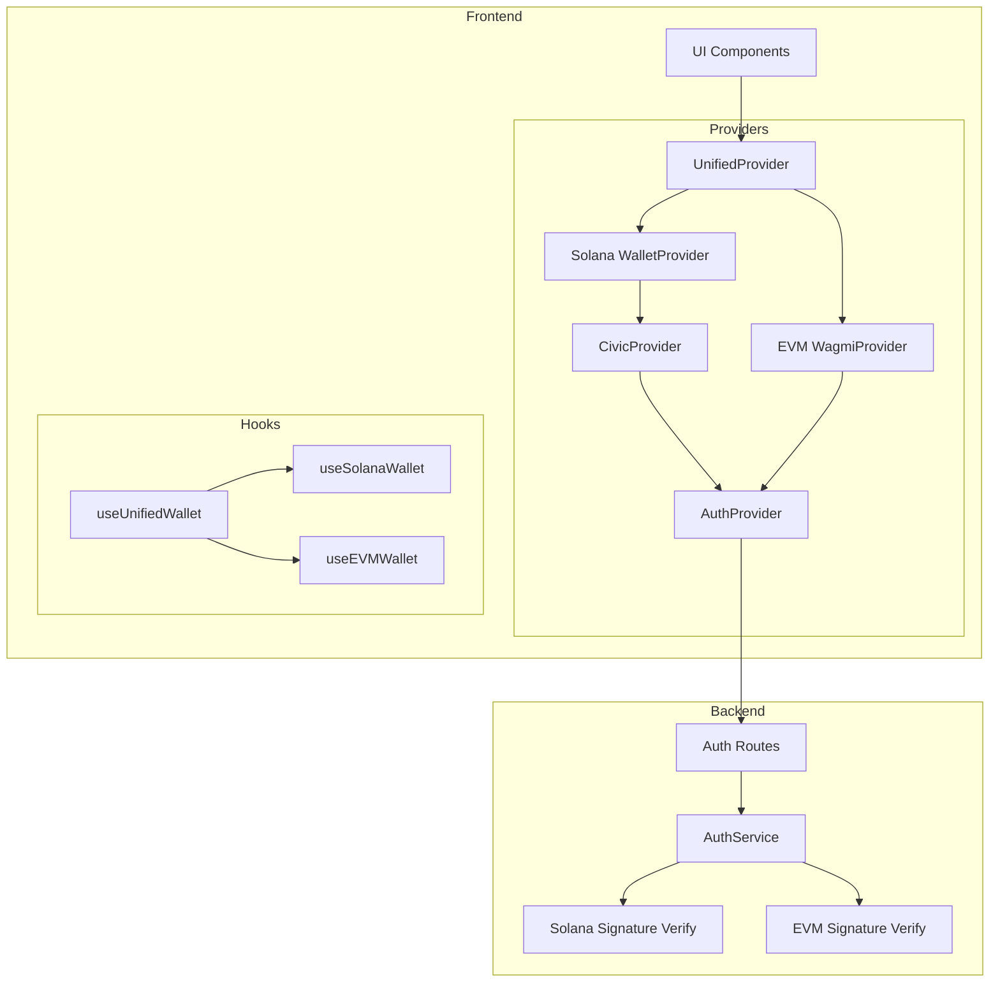

# Multi-Chain Wallet Integration Plan

## Problem Summary

The application is experiencing three interconnected errors when users attempt to sign in:

### Error 1: Civic API CORS/Network Errors
```
HEAD https://auth.civic.com/oauth net::ERR_BLOCKED_BY_RESPONSE.NotSameOrigin 404
HEAD https://api.civic.com/ net::ERR_ABORTED 403 (Forbidden)
GET https://gatekeeper-api.civic.com/v1/token/... net::ERR_NAME_NOT_RESOLVED
```

**Root Cause:** The `checkCivicApiAvailability()` function in `CivicProvider.tsx:41-73` attempts to make HEAD requests to Civic endpoints, but:
- Civic servers block cross-origin HEAD requests (CORS policy)
- `gatekeeper-api.civic.com` is not resolvable on corporate networks/VPNs
- The `no-cors` mode doesn't prevent the console errors from appearing

### Error 2: MetaMask + Solana Wallet Adapter Incompatibility
```
WalletSignMessageError: At path: request -- Expected the value to satisfy a union of `object | object | object | object`
```

**Root Cause:** MetaMask is detected as a Standard Wallet via the Wallet Standard API, but when the Solana adapter tries to call `signMessage`, MetaMask cannot handle the Solana signing request format.

### Error 3: Phantom Fallback Failure
```
Ue: Unexpected error at #n (solana.js:13:42903) at async r.signMessage
```

**Root Cause:** After MetaMask fails, the code attempts to fallback to Phantom's direct API (`window.phantom.solana.signMessage`), but since MetaMask is the connected wallet (not Phantom), this fails.

---

## Solution Architecture

Since multi-chain support (Solana + EVM) is required, we need to:

1. **Add EVM wallet infrastructure** (wagmi + viem)
2. **Create unified wallet management** that handles both chains
3. **Update authentication** to detect wallet type and use appropriate signing
4. **Fix Civic integration** to avoid CORS errors

### Architecture Diagram



---

## Implementation Plan

### Phase 1: Immediate Fixes (Stop the Errors)

#### 1.1 Fix CivicProvider CORS Errors

**File:** `apps/web/providers/CivicProvider.tsx`

**Changes:**
- Remove the `checkCivicApiAvailability()` function entirely
- Use environment variable `NEXT_PUBLIC_CIVIC_DISABLED` as the primary control
- Add a simpler, non-blocking check that doesn't cause console errors

```typescript
// Remove lines 41-73 (checkCivicApiAvailability function)
// Simplify the provider to just check the environment flag
```

#### 1.2 Update Environment Configuration

**File:** `apps/web/.env.local`

**Changes:**
```env
# Disable Civic by default to prevent network errors
NEXT_PUBLIC_CIVIC_DISABLED=true
```

#### 1.3 Add Wallet Type Detection in AuthProvider

**File:** `apps/web/providers/AuthProvider.tsx`

**Changes:**
- Detect if connected wallet is Solana-compatible before attempting to sign
- Show clear error message if MetaMask or other EVM wallets try to sign

```typescript
// Add wallet type detection
const isEvmWallet = (adapter: WalletAdapter): boolean => {
  const evmWalletNames = ['metamask', 'coinbase', 'rainbow', 'walletconnect'];
  return evmWalletNames.some(name => 
    adapter.name.toLowerCase().includes(name)
  );
};

// In login function, check wallet type first
if (wallet?.adapter && isEvmWallet(wallet.adapter)) {
  toast({
    title: 'Unsupported Wallet',
    description: 'Please use a Solana wallet like Phantom. MetaMask and other EVM wallets are not yet supported.',
    variant: 'destructive',
  });
  return;
}
```

---

### Phase 2: Add EVM Wallet Support (Full Multi-Chain)

#### 2.1 Install EVM Dependencies

```bash
npm install wagmi viem @tanstack/react-query @rainbow-me/rainbowkit
```

#### 2.2 Create EVM Wallet Provider

**File:** `apps/web/providers/EVMWalletProvider.tsx`

```typescript
'use client';

import { FC, ReactNode } from 'react';
import { WagmiProvider, createConfig, http } from 'wagmi';
import { mainnet, sepolia, polygon } from 'wagmi/chains';
import { QueryClient, QueryClientProvider } from '@tanstack/react-query';
import { RainbowKitProvider, getDefaultWallets } from '@rainbow-me/rainbowkit';

const { connectors } = getDefaultWallets({
  appName: 'RWA Asset Platform',
  projectId: process.env.NEXT_PUBLIC_WALLETCONNECT_PROJECT_ID || '',
});

const config = createConfig({
  chains: [mainnet, sepolia, polygon],
  connectors,
  transports: {
    [mainnet.id]: http(),
    [sepolia.id]: http(),
    [polygon.id]: http(),
  },
});

const queryClient = new QueryClient();

export const EVMWalletProvider: FC<{ children: ReactNode }> = ({ children }) => {
  return (
    <WagmiProvider config={config}>
      <QueryClientProvider client={queryClient}>
        <RainbowKitProvider>
          {children}
        </RainbowKitProvider>
      </QueryClientProvider>
    </WagmiProvider>
  );
};
```

#### 2.3 Create Unified Wallet Hook

**File:** `apps/web/hooks/useUnifiedWallet.ts`

```typescript
'use client';

import { useWallet as useSolanaWallet } from '@solana/wallet-adapter-react';
import { useAccount, useSignMessage } from 'wagmi';

export type WalletType = 'solana' | 'evm' | null;

export interface UnifiedWallet {
  // Connection state
  isConnected: boolean;
  walletType: WalletType;
  address: string | null;
  
  // Solana specific
  solanaPublicKey: PublicKey | null;
  solanaSignMessage: (message: Uint8Array) => Promise<Uint8Array>;
  
  // EVM specific
  evmAddress: string | null;
  evmSignMessage: (message: string) => Promise<string>;
  
  // Unified
  disconnect: () => Promise<void>;
}

export function useUnifiedWallet(): UnifiedWallet {
  // Solana wallet state
  const solana = useSolanaWallet();
  
  // EVM wallet state
  const { address: evmAddress, isConnected: evmConnected } = useAccount();
  const { signMessageAsync } = useSignMessage();
  
  // Determine which wallet is active
  const walletType: WalletType = solana.connected 
    ? 'solana' 
    : evmConnected 
      ? 'evm' 
      : null;
  
  return {
    isConnected: solana.connected || evmConnected,
    walletType,
    address: solana.publicKey?.toBase58() || evmAddress || null,
    
    solanaPublicKey: solana.publicKey,
    solanaSignMessage: async (message: Uint8Array) => {
      if (!solana.signMessage) throw new Error('Solana signing not available');
      return solana.signMessage(message);
    },
    
    evmAddress: evmAddress || null,
    evmSignMessage: async (message: string) => {
      return signMessageAsync({ message });
    },
    
    disconnect: async () => {
      if (solana.connected) await solana.disconnect();
      // wagmi disconnect handled separately
    },
  };
}
```

#### 2.4 Update AuthProvider for Multi-Chain

**File:** `apps/web/providers/AuthProvider.tsx`

Key changes:
- Use `useUnifiedWallet` hook
- Detect wallet type and use appropriate signing method
- Handle both Solana (bs58 encoded) and EVM (hex) signatures

```typescript
const login = useCallback(async () => {
  const { walletType, address, solanaSignMessage, evmSignMessage } = unifiedWallet;
  
  if (!address) {
    toast({ title: 'Wallet Required', ... });
    return;
  }

  // Get nonce from server
  const { message } = await api.auth.getNonce(address);

  let signature: string;
  
  if (walletType === 'solana') {
    const messageBytes = new TextEncoder().encode(message);
    const signatureBytes = await solanaSignMessage(messageBytes);
    signature = bs58.encode(signatureBytes);
  } else if (walletType === 'evm') {
    signature = await evmSignMessage(message);
  } else {
    throw new Error('Unknown wallet type');
  }

  // Login with signature and wallet type
  const { user } = await api.auth.login(address, signature, walletType);
  // ...
}, [unifiedWallet, toast]);
```

#### 2.5 Update Backend AuthService

**File:** `apps/api/src/services/AuthService.ts`

Add EVM signature verification:

```typescript
import { verifyMessage } from 'viem';

async verifySignature(
  walletAddress: string, 
  message: string, 
  signature: string,
  walletType: 'solana' | 'evm'
): Promise<boolean> {
  if (walletType === 'solana') {
    // Existing Solana verification
    const publicKey = new PublicKey(walletAddress);
    const messageBytes = new TextEncoder().encode(message);
    const signatureBytes = bs58.decode(signature);
    return nacl.sign.detached.verify(messageBytes, signatureBytes, publicKey.toBytes());
  } else if (walletType === 'evm') {
    // EVM verification using viem
    const isValid = await verifyMessage({
      address: walletAddress as `0x${string}`,
      message,
      signature: signature as `0x${string}`,
    });
    return isValid;
  }
  return false;
}
```

---

### Phase 3: UI Updates

#### 3.1 Create Unified Wallet Button

**File:** `apps/web/components/wallet/UnifiedWalletButton.tsx`

A button that shows connection options for both Solana and EVM wallets:

```typescript
export function UnifiedWalletButton() {
  const [showChainSelector, setShowChainSelector] = useState(false);
  const { walletType, address, isConnected } = useUnifiedWallet();
  
  if (isConnected) {
    return (
      <div className="flex items-center gap-2">
        <Badge variant={walletType === 'solana' ? 'purple' : 'blue'}>
          {walletType === 'solana' ? 'SOL' : 'ETH'}
        </Badge>
        <span>{address?.slice(0, 6)}...{address?.slice(-4)}</span>
      </div>
    );
  }
  
  return (
    <DropdownMenu>
      <DropdownMenuTrigger>Connect Wallet</DropdownMenuTrigger>
      <DropdownMenuContent>
        <DropdownMenuItem onClick={() => /* open Solana modal */}>
          <SolanaIcon /> Connect Solana Wallet
        </DropdownMenuItem>
        <DropdownMenuItem onClick={() => /* open EVM modal */}>
          <EthereumIcon /> Connect Ethereum Wallet
        </DropdownMenuItem>
      </DropdownMenuContent>
    </DropdownMenu>
  );
}
```

---

## File Changes Summary

| File | Action | Description |
|------|--------|-------------|
| `apps/web/.env.local` | Modify | Add `NEXT_PUBLIC_CIVIC_DISABLED=true` |
| `apps/web/providers/CivicProvider.tsx` | Modify | Remove CORS-triggering API check |
| `apps/web/providers/AuthProvider.tsx` | Modify | Add wallet type detection, multi-chain signing |
| `apps/web/providers/EVMWalletProvider.tsx` | Create | New EVM wallet provider using wagmi |
| `apps/web/providers/index.tsx` | Modify | Add EVMWalletProvider to provider stack |
| `apps/web/hooks/useUnifiedWallet.ts` | Create | Unified hook for both wallet types |
| `apps/web/components/wallet/UnifiedWalletButton.tsx` | Create | Multi-chain wallet connection UI |
| `apps/api/src/services/AuthService.ts` | Modify | Add EVM signature verification |
| `apps/api/src/routes/auth.ts` | Modify | Accept walletType parameter |
| `apps/web/package.json` | Modify | Add wagmi, viem, rainbowkit dependencies |

---

## Quick Fix (Immediate - Phase 1 Only)

If you want to just **stop the errors immediately** without full multi-chain support:

1. **Enable Civic disabled flag:**
   ```env
   # apps/web/.env.local
   NEXT_PUBLIC_CIVIC_DISABLED=true
   ```

2. **Add wallet type check in AuthProvider** to show a user-friendly error when MetaMask tries to connect:
   ```typescript
   // At the start of login()
   const adapterName = wallet?.adapter?.name?.toLowerCase() || '';
   if (adapterName.includes('metamask') || adapterName.includes('coinbase')) {
     toast({
       title: 'Solana Wallet Required',
       description: 'This application currently only supports Solana wallets like Phantom. EVM wallet support coming soon!',
       variant: 'destructive',
     });
     return;
   }
   ```

3. **Remove the problematic API availability check** in CivicProvider.tsx

---

## Recommended Approach

I recommend implementing **Phase 1** first to immediately stop the errors, then proceeding with **Phase 2** for full multi-chain support based on your timeline.

Would you like me to proceed with implementing Phase 1 (quick fix) or the full multi-chain solution (Phase 1 + Phase 2)?