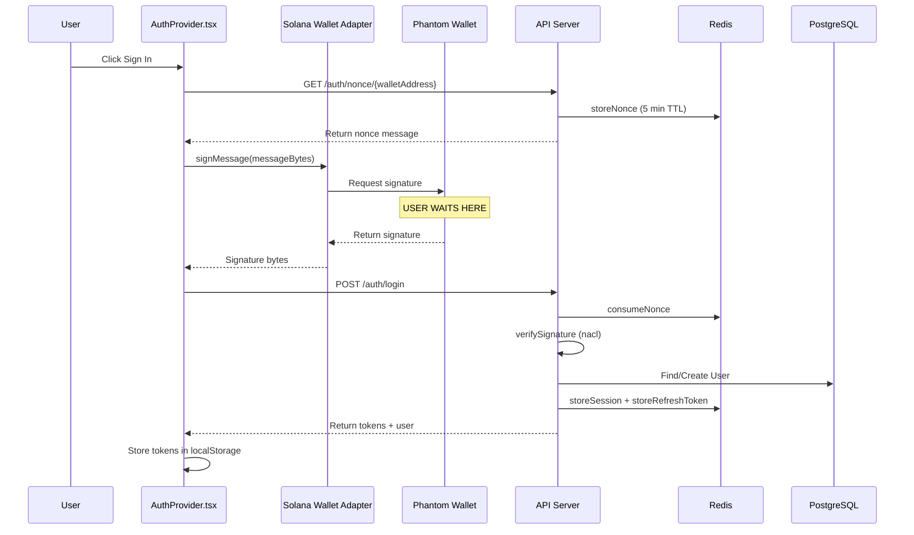

# Phantom Wallet Signing Message - Slow Performance Analysis

## Problem Statement
The signing message flow in Phantom wallet is taking too long when authenticating with the RWA Asset Platform.

---

## Flow Analysis

### Authentication Flow Diagram



---

## Identified Bottlenecks

### 1. **Multiple Signing Methods Fallback** (Likely Cause)
**Location:** [`AuthProvider.tsx:140-339`](apps/web/providers/AuthProvider.tsx:140)

The [`signMessageWithWallet()`](apps/web/providers/AuthProvider.tsx:140) function attempts up to **4 different signing methods** sequentially:

1. **Method 1:** `useWallet signMessage` hook (line 206-227)
2. **Method 2:** Direct Phantom `window.phantom.solana.signMessage` (line 229-249)
3. **Method 3:** Legacy `window.solana.signMessage` (line 251-266)
4. **Method 4:** Internal adapter methods (line 268-333)

**Issue:** If Method 1 fails or times out, the code catches the error and attempts subsequent methods, adding cumulative delay.

### 2. **60-Second Timeout Setting** (Configuration Issue)
**Location:** [`AuthProvider.tsx:184-202`](apps/web/providers/AuthProvider.tsx:184)

```typescript
const withSigningTimeout = <T,>(promise: Promise<T>, timeoutMs: number = 60000): Promise<T> => {
```

The timeout is set to **60 seconds**, which means:
- Users may wait up to a full minute before seeing a timeout error
- The actual signing should be near-instantaneous once the user approves

### 3. **API Request Before Signing** (Network Latency)
**Location:** [`AuthProvider.tsx:384`](apps/web/providers/AuthProvider.tsx:384)

```typescript
const { message } = await api.auth.getNonce(walletAddress);
```

**Issue:** The nonce fetch happens synchronously before signing. If the backend is slow or Redis connection has latency, this adds delay.

### 4. **Backend Signature Verification** (Potential Issue)
**Location:** [`AuthService.ts:201-217`](apps/api/src/services/AuthService.ts:201)

```typescript
private verifySignature(walletAddress: string, signature: string, message: string): boolean {
  const signatureBytes = Buffer.from(signature, 'base64');  // BUG: Should be base58!
  return nacl.sign.detached.verify(messageBytes, signatureBytes, publicKeyBytes);
}
```

**Critical Bug Found:** The signature is decoded as **base64** but the frontend encodes it as **base58**:

```typescript
// Frontend: AuthProvider.tsx:403
const signature = bs58.encode(signatureBytes);

// Backend: AuthService.ts:210
const signatureBytes = Buffer.from(signature, 'base64');  // WRONG!
```

This encoding mismatch could cause:
- Signature verification failures
- Users retrying multiple times
- Perceived slowness due to failed attempts

### 5. **Redis Connection Latency**
**Location:** [`redis.ts:11-20`](apps/api/src/lib/redis.ts:11)

```typescript
export const redis = new Redis(config.redisUrl, {
  maxRetriesPerRequest: 3,
  lazyConnect: true,
  retryStrategy: (times) => {
    if (times > 3) return null;
    return Math.min(times * 100, 3000);
  },
});
```

**Issue:** With `lazyConnect: true`, the first Redis operation may have additional connection overhead. The retry strategy can add up to 3 seconds of delay per retry.

### 6. **Database Operations**
**Location:** [`AuthService.ts:159-179`](apps/api/src/services/AuthService.ts:159)

The authentication creates/updates user records:
- `prisma.user.findUnique()` - Database read
- `prisma.user.create()` - If new user (database write)
- `prisma.user.update()` - Update lastLoginAt (database write)

These are sequential and not optimized.

---

## Console Logs Analysis

From the provided logs:
```
AuthProvider.tsx:143 [AuthProvider] signMessageWithWallet called, adapter: Phantom connected: true
AuthProvider.tsx:208 [AuthProvider] Method 1: Trying useWallet signMessage...
```

This shows:
- Phantom is correctly detected
- Method 1 (`useWallet signMessage`) is being attempted
- **No subsequent "succeeded" log appears immediately** - indicating the wallet popup is waiting for user action

---

## Root Cause Summary

| Priority | Issue | Impact |
|----------|-------|--------|
| 🔴 High | Signature encoding mismatch (base58 vs base64) | Authentication may fail entirely |
| 🟠 Medium | 60-second timeout is too long | Poor UX, users wait too long for errors |
| 🟠 Medium | Multiple signing method fallbacks | Adds delay if primary method fails |
| 🟡 Low | Network latency to fetch nonce | Adds ~100-500ms typically |
| 🟡 Low | Redis lazy connection | First request may be slower |

---

## Recommendations

### 1. **Fix Signature Encoding Bug (Critical)**

**File:** [`apps/api/src/services/AuthService.ts`](apps/api/src/services/AuthService.ts:210)

```typescript
// BEFORE (Bug):
const signatureBytes = Buffer.from(signature, 'base64');

// AFTER (Fix):
import bs58 from 'bs58';
const signatureBytes = bs58.decode(signature);
```

### 2. **Reduce Signing Timeout**

**File:** [`apps/web/providers/AuthProvider.tsx`](apps/web/providers/AuthProvider.tsx:184)

```typescript
// BEFORE:
const withSigningTimeout = <T,>(promise: Promise<T>, timeoutMs: number = 60000)

// AFTER (30 seconds is more reasonable):
const withSigningTimeout = <T,>(promise: Promise<T>, timeoutMs: number = 30000)
```

### 3. **Add Performance Timing Logs**

Add timing logs to identify which step is slow:

```typescript
const login = useCallback(async () => {
  const startTime = performance.now();
  
  // Step 1: Get nonce
  const nonceStart = performance.now();
  const { message } = await api.auth.getNonce(walletAddress);
  console.log(`[Timing] Nonce fetch: ${performance.now() - nonceStart}ms`);
  
  // Step 2: Sign message
  const signStart = performance.now();
  const signatureBytes = await signMessageWithWallet(messageBytes);
  console.log(`[Timing] Message signing: ${performance.now() - signStart}ms`);
  
  // Step 3: Login API call
  const loginStart = performance.now();
  const { user } = await api.auth.login(walletAddress, signature);
  console.log(`[Timing] Login API: ${performance.now() - loginStart}ms`);
  
  console.log(`[Timing] Total: ${performance.now() - startTime}ms`);
}, [...]);
```

### 4. **Prefetch Nonce on Wallet Connect**

Instead of fetching nonce when user clicks "Sign In", prefetch it when wallet connects:

```typescript
useEffect(() => {
  if (connected && publicKey && !state.isAuthenticated) {
    // Prefetch nonce in background
    api.auth.getNonce(publicKey.toBase58()).catch(() => {});
  }
}, [connected, publicKey, state.isAuthenticated]);
```

### 5. **Optimize Backend Flow**

Parallelize database operations where possible:

```typescript
// BEFORE (Sequential):
let user = await prisma.user.findUnique({ where: { walletAddress } });
if (!user) {
  user = await prisma.user.create({ data: {...} });
}
await prisma.user.update({ where: { id: user.id }, data: { lastLoginAt: new Date() } });

// AFTER (Use upsert):
const user = await prisma.user.upsert({
  where: { walletAddress },
  create: { walletAddress, role: 'INVESTOR', kycStatus: 'PENDING', lastLoginAt: new Date() },
  update: { lastLoginAt: new Date() },
});
```

### 6. **Enable Redis Connection Pool**

**File:** [`apps/api/src/lib/redis.ts`](apps/api/src/lib/redis.ts:11)

```typescript
export const redis = new Redis(config.redisUrl, {
  maxRetriesPerRequest: 3,
  lazyConnect: false,  // Connect immediately on startup
  enableReadyCheck: true,
  retryStrategy: (times) => {
    if (times > 3) return null;
    return Math.min(times * 50, 1000);  // Faster retries
  },
});
```

---

## Implementation Priority

1. **Immediate Fix:** Signature encoding bug (base58 vs base64)
2. **Quick Win:** Add performance timing logs to identify exact bottleneck
3. **UX Improvement:** Reduce timeout to 30 seconds
4. **Optimization:** Prefetch nonce on wallet connect
5. **Backend:** Use `upsert` instead of find+create+update

---

## Testing Recommendations

1. **Clear browser cache and localStorage** before testing
2. **Check Chrome DevTools Network tab** for API latency
3. **Monitor console for timing logs** after implementing them
4. **Test with different network conditions** (slow 3G simulation)
5. **Verify Phantom popup appears immediately** - if delayed, issue is pre-signing